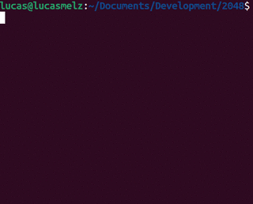

# Uma implementação em C do jogo 2048
(Scroll down for English README).

## Sobre o projeto 

O objetivo deste projeto é implementar o jogo 2048 em C para ser jogado no terminal. Pode-se personalizar as dimensões do tabuleiro, isto é, quando o programa é executado, pergunta-se ao utilizador qual o tamanho do tabuleiro (8x8, 4x4, 16x16, etc) antes do jogo iniciar. As peças podem ser movimentadas em 4 direções: Baixo, Cima, Direita  e  Esquerda (comandos B, C, D e E). Quando duas peças adjacentes possuem o mesmo valor, podem ser combinadas, resultando numa nova peça com o valor correspondente à soma das duas peças. O jogo possui dois modos distintos, interativo e automático. No modo interativo, o utilizador deve realizar as jogadas em tempo real digitando os comandos supracitados no terminal. No modo automático, as jogadas são lidas a partir de um ficheiro de texto. 
<div align="center">

</div>

## Como executar

1. Compilar a biblioteca com o comando:
```
gcc -c biblioteca_2048.c
```
2. Compilar o jogo (interativo ou automático):
  ```
  gcc -c interativo.c
  ```
  ou

  ```
  gcc -c automatico.c
  ```
3. Conectar a biblioteca ao jogo em um executável `main`
  ```
  gcc -o main interativo.o biblioteca_2048.o -lm
  ```
  ou

  ```
  gcc -o main automatico.o biblioteca_2048.o -lm
  ```
4. Executar o jogo:
  ```
  ./main
  ```

## Modo interativo

A grelha inicial é prrenchida em duas posições aleatórias, com o número 2 ou 4. Em cada jogada: 
1. O jogador escolhe um sentido (B, C, D, E);
2. O tabuleiro é atualizado de acordo com as regras do jogo;
3. Uma nova peça de valor 2 ou 4 é adicionada de forma aleatória numa posição vazia.
O jogo termina quando o jogador digita o comando 'F' ou quando não for mais possível combinar peças. Ao término do jogo, apresenta-se o número total de peças combinadas e uma contagem de quantas peças com cada número existem no tabuleiro.

## Modo automático 
É exatamente tal como no modo interativo, todavia, os inputs são lidos a partir de um arquivo .txt. Ou seja, a dimensão do tabuleiro, a configuração inicial do tabuleiro e as jogadas consecutivas são lidas a partir do ficheiro de texto.

# An implementation of the 2048 game in C

## About the project

The goal of this project is to implement the 2048 game in C to be played in the terminal. It's possible to customize the board dimensions, that is, when the program is executed, the user is asked what size the board should be (8x8, 4x4, 16x16, etc) before the game starts. The pieces can be moved in 4 directions: Down, Up, Right, and Left (commands B, C, D and E, which stands for the initial letters of those directions in Portuguese). When two adjacent pieces have the same value, they can be combined, resulting in a new piece with the value corresponding to the sum of the two pieces. The game has two distinct modes, interactive and automatic. In the interactive mode, the user must perform the moves in real-time by typing the aforementioned commands in the terminal. In automatic mode, the moves are read from a text file.
<div align="center">

</div>

## How to execute

1. Compile the library with the command:
```
gcc -c biblioteca_2048.c
```
2. Compile the game (interactive or automatic): 
```
gcc -c interativo.c
```
or

```
gcc -c automatico.c
```
3. Connect the library to the game into an executable `main`:
```
gcc -o main interativo.o biblioteca_2048.o -lm
```
or

```
gcc -o main automatico.o biblioteca_2048.o -lm
```
4. Execute the game:
```
./main
```

## Interactive mode

The initial grid is filled in two random positions with the number 2 or 4. In each move:
1. The player chooses a direction (B, C, D, E);
2. The board is updated according to the game's rules;
3. A new piece with a value of 2 or 4 is added randomly to an empty position.
The game ends when the player types the command 'F' or when it is no longer possible to combine pieces. At the end of the game, the total number of combined pieces is presented and a count of how many pieces of each number exist on the board.

## Automatic mode
It is exactly as in the interactive mode, however, the inputs are read from a .txt file. That is, the board dimensions, the initial board setup, and the consecutive moves are read from the text file.


